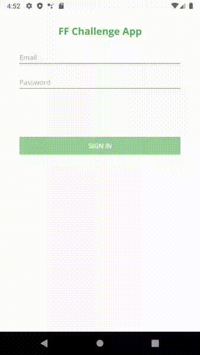

# FF Challenge

Technical test for Senior Android Developer

## Functional Features
1) Create a simple login, where the user must authenticate against a local database or SharedPreferences
2) The stored data must be encrypted with some encryption algorithm such as AES256
3) When making a valid login, it must direct a view that contains the title "hello <username>" and that shows a list of data from the following API: https://www.mindicador.cl/api
4) Invalid login must be validated
5) The listing should only show the attributes "name" and "value"
6) The view that contains the listing must contain a search filter that works by "code"
7) At the moment of clicking on an element of the list, it must display another view of the detail type with the complete JSON object: "code", "name", "unit_measured", "date", "value"
8) It should be possible to go back from the detail view
9) The main view must contain a logout button that returns to the login view

## Non-Functional Features

1) The language to use is Kotlin
2) The architecture patterns to be used for this development are MVVM or MVP
3) Unit tests must be created to the Model, ViewModel or UseCase class depending on the chosen architecture pattern
4) Dagger can be used for dependency injection
5) Retrofit2 must be used for API invocation
6) Roboelectric and Mockito should be used for unit tests
7) Unit tests must have a minimum coverage percentage of 80%
8) The development of the app must be with Android Jetpack
9) The app must support from API 21 to 28

## Demo (GIF)

## Data Test

    * Email: user1@ff.com / Password: asdasd
    * Email: user2@ff.com / Password: asdasd
    * Email: user3@ff.com / Password: asdasd
    
## Flavors Environments

This project contains 3 environments: dummy, dev and prod. Dummy flavor point to a local Json with the same
payload from dev/prod endpoint. Otherwise, dev and prod point to remote api rest. Note: Recommend test these
environments pointing app, currencies and auth into same flavor.

## Technical Specs

    * Tech-stack
        * Programming Language: Kotlin
        * Dependency Injection: KodeIn
        * Retrofit
        * Android Jetpack
            * Navigation
            * LiveData
            * Lifecycle
            * ViewModel
            * Room
        *  Coil - image loading library with Kotlin idiomatic API
    * Architecture
        * Clean Architecture (at module level)
        * MVVM + MVI (presentation layer)
        * Dynamic feature modules
        * Android Architecture components
    * Tests
        * Unit Tests
        * Mockito
        * Kluent
    * Gradle
        * Gradle Kotlin DSL
        * Custom tasks
        * Plugins 
            * Ktlint
            * Jacoco Code Coverage
        
## Architecture

Feature related code is placed inside one of the feature modules.
We can think about each feature as the equivalent of microservice or private library.

The modularized code-base approach provides few benefits:

    * better separation of concerns. Each module has a clear API, Feature related classes life in different modules and can't be referenced without explicit module dependency.
    * features can be developed in parallel eg. by different teams
    * each feature can be developed in isolation, independently from other features
    * faster compile time 

### Feature module structure

`Clean architecture` is the "core architecture" of the application, so each `feature module` contains own set of Clean architecture layers:

#### Presentation layer

This layer is closest to what the user sees on the screen. The `presentation` layer is a mix of `MVVM` (Jetpack `ViewModel` used to preserve data across activity restart) and
`MVI` (`actions` modify the `common state` of the view and then new state is edited to a view via `LiveData` to be rendered).

> `common state` (for each view) approach derives from
> Unidirectional Data Flow and Redux.

Components:

    * **View (Fragment)** - presents data on the screen and pass user interactions to View Model. Views are hard to test, so they should be as simple as possible.
    * **ViewModel** - dispatches (through `LiveData`) state changes to the view and deals with user interactions (these view models are not simply POJO classes).
    * **ViewState** - common state for a single view
    * **Mapper** - class for mapping classes between layer for decouple responsibilities
    * **NavManager** - singleton that facilitates handling all navigation events inside `NavHostActivity` (instead of separately, inside each view)

#### Domain layer

This is the core layer of the application. Notice that the `domain` layer is independent of any other layers. This allows to make domain models and business logic independent from other layers.
In other words, changes in other layers will have no effect on `domain` layer eg. changing database (`data` layer) or screen UI (`presentation` layer) ideally will not result in any code change withing `domain` layer.

Components:

    * **UseCase** - contains business logic
    * **DomainModel** - defies the core structure of the data that will be used within the application. This is the source of truth for application data.
    * **Repository interface** - required to keep the `domain` layer independent from the `data layer`.

#### Data layer

Manages application data and exposes these data sources as repositories to the `domain` layer. Typical responsibilities of this layer would be to retrieve data from the internet and optionally cache this data locally.

Components:

    * **Repository** is exposing data to the `domain` layer. Depending on application structure and quality of the external APIs repository can also merge, filter, and transform the data. The intention of
    these operations is to create high-quality data source for the `domain` layer, not to perform any business logic (`domain` layer `use case` responsibility).
    * **Mapper** - maps `data model` to `domain model` (to keep `domain` layer independent from the `data` layer).
    * **RetrofitService** - defines a set of API endpoints.
    * **DataModel** - defines the structure of the data retrieved from the network and contains annotations, so Retrofit (Moshi) understands how to parse this network data (XML, JSON, Binary...) this data into objects.

## Ci pipeline

These are all of the Gradle tasks (cmd commands) that are [executed by CI](/.circleci/circle.yml):

* `./gradlew lintDummyDebug` - runs Android lint
* `./gradlew detekt` - runs detekt
* `./gradlew ktlintCheck` - runs ktlint
* `./gradlew testDummyDebugUnitTest` - run unit tests
* `./gradlew testDummyDebugUnitTestCoverage` - check Jacoco for Code Coverage Verification
* `./gradlew :app:bundleDebug` - create app bundle

On top of that project contains a custom `./gradlew staticCheck` task that mimics all CI tasks and is intended to run on
a local computer.

## Test Coverage

### App orchestrator module

### Auth dynamic module

### Currencies dynamic module

## Getting started

1. Android Studio -> File -> New -> From Version control -> Git
2. Enter `https://github.com/anibalbastiass/android.ff.challenge.git` into URL field
